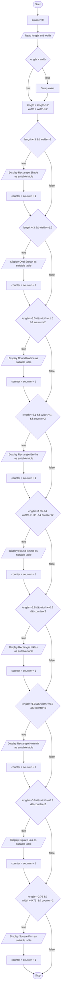

##Flowchart for fibonacci numbers

This is my design of flowchart for solving problem of finding specific fibonacci number 

```mermaid
flowchart TD;
    A([Start]) --> Ini[counter=0] --> In[/Read length and width/] --> Ch{length > width}
    Ch -- true --> P[length = length-3.2 <br> width = width-3.2]
    Ch -- false --> Swap[Swap value] --> P --> If1{length>=3 && width>=1}
    
    If1 -- true --> Out1[/Display Rectangle Shade as suitable table/] --> P1[counter = counter + 1] --> If2{length>=3 && width>=1.3}
    If1 -- false --> If2
    
    If2 -- true --> Out2[/Display Oval Stefan as suitable table/] --> P2[counter = counter + 1] --> If3{length>=1.5 && width>=1.5 && counter<2}
    If2 -- false --> If3
    
    If3 -- true --> Out3[/Display Round Nadine as suitable table/] --> P3[counter = counter + 1] --> If4{length>=2.1 && width>=1  && counter<2}
    If3 -- false --> If4
    
    If4 -- true --> Out4[/Display Rectangle Bertha as suitable table/] --> P4[counter = counter + 1] --> If5{length>=1.35 && width>=1.35  && counter<2} 
    If4 -- false --> If5
    
    If5 -- true --> Out5[/Display Round Emma as suitable table/] --> P5[counter = counter + 1] --> If6{length>=1.5 && width>=0.9  && counter<2}
    If5 -- false --> If6
    
    If6 -- true --> Out6[/Display Rectangle Niklas as suitable table/] --> P6[counter = counter + 1] --> If7{length>=1.3 && width>=0.8  && counter<2}
    If6 -- false --> If7
    
    If7 -- true --> Out7[/Display Rectangle Heinrich as suitable table/] --> P7[counter = counter + 1] --> If8{length>=0.9 && width>=0.9  && counter<2}
    If7 -- false --> If8
    
    If8 -- true --> Out8[/Display Square Lea as suitable table/] --> P8[counter = counter + 1] --> If9{length>=0.76 && width>=0.76  && counter<2}
    If8 -- false --> If9
    
    If9 -- true --> Out9[/Display Square Finn as suitable table/] --> P9[counter = counter + 1] --> Z([Stop])
    If9 -- false --> Z
    
```
